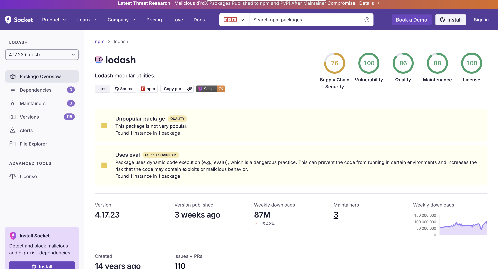
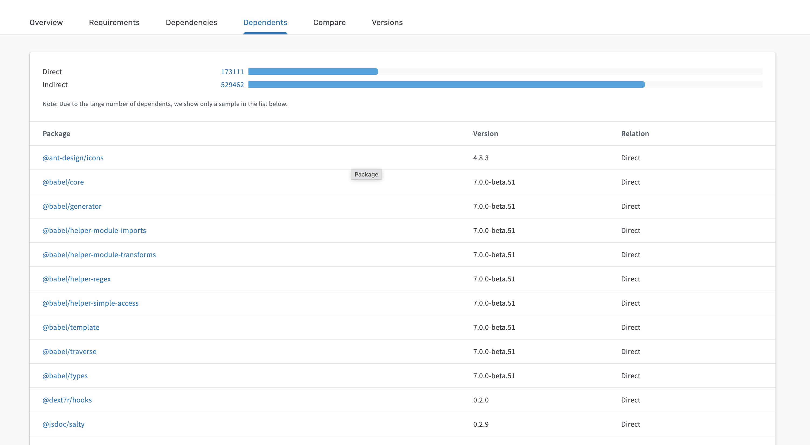
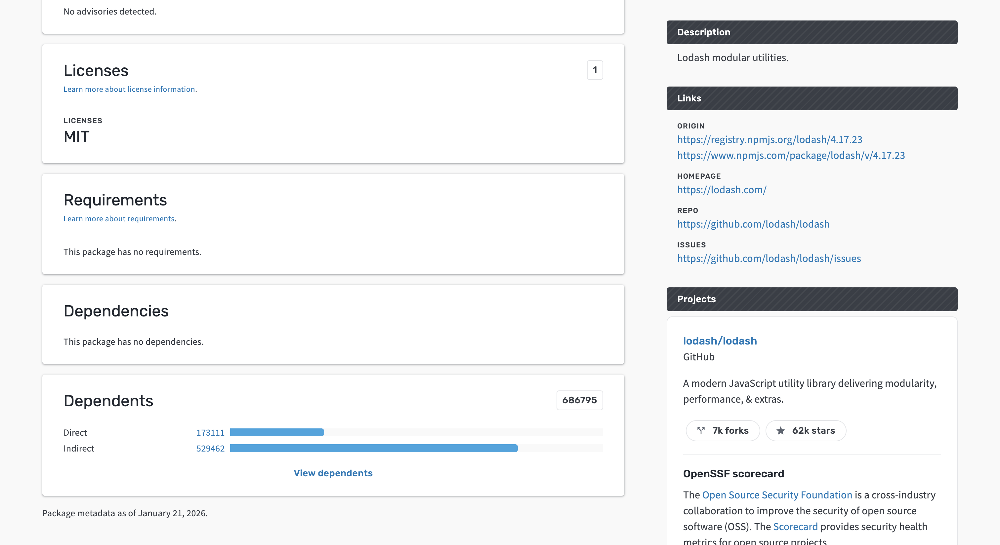
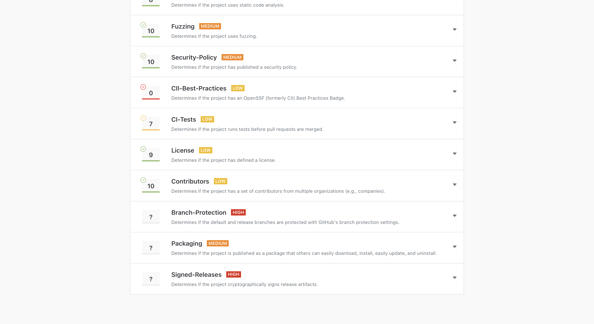

# Підсумок Лабараторної роботи — SCA (Software Composition Analysis) та відповіді на домашнє завдання

Коротко: у цьому файлі зібрані відповіді та підсумки за Лабараторної роботи (аналіз npm‑залежностей із SCA‑інструментами) та пов’язане аналітичне завдання з домашнього завдання (SAST/DAST/IAST/RASP). Документ призначений як готовий підсумок для завантаження в LMS.

---

## 1) Що зроблено (коротко)
- Виконано огляд SCA‑процесу: Socket.dev, deps.dev, OpenSSF Scorecard, OSV‑Scanner, Syft (SBOM), Grype (сканування SBOM).  
- Вибрано приклади пакетів для аналізу: `jsonwebtoken@8.5.1` (приклад у завданні), `lodash@4.17.19` (поширений), `axios@0.21.1` (приклад HTTP‑клієнта).  
- Задокументовано шаблон звіту (попередній аналіз, граф залежностей, OSV/Grype результати, SBOM, рекомендації).

---

## 2) Відповіді по кроках Лабараторної роботи

### Вибрані пакети
- jsonwebtoken 8.5.1 — приклад із завдання (має відомі CVE у старих версіях).  
- lodash 4.17.19 — часто зустрічається в проєктах; увага на prototype‑pollution для старих версій.  
- axios 0.21.1 — приклад HTTP‑клієнта; перевірити залежності і відомі CVE в залежностях.

### Кроки й типові висновки (що робити і які артефакти збирати)
1. Socket.dev — швидка перевірка ризиків (install‑scripts, eval, suspicious APIs). Зробити скриншот `Overview` і короткий висновок (risk/no‑risk).
2. deps.dev — перегляд graph → зафіксувати кількість прямих/транзитивних залежностей + виявити підозрілі транзитиви.
3. OpenSSF Scorecard — оцінка гігієни розробки (branch protection, CI, codeowners) — записати score та ключові проблеми.
4. OSV‑Scanner — запустити на тестовому проєкті → отримати список CVE (CVE ID, CVSS, рекомендації).
5. EPSS/manual CVE lookup — для критичних CVE оцінити ймовірність експлуатації (EPSS) і пріоритезувати.
6. Syft → згенерувати SBOM (CycloneDX JSON).  
   - Команда: `syft dir:. -o cyclonedx-json > sbom.json`  
7. Grype → просканувати `sbom.json` і отримати підсумковий список вразливостей.

---

## 3) Приклад (зразок заповнення шаблону для `jsonwebtoken@8.5.1` — з Лабараторної роботи)
- Попередній аналіз (Socket.dev): виявлено `eval()` → помірний ризик.  
- Граф залежностей (deps.dev): прямі залежності — 5; транзитивні — 42.  
- OpenSSF Scorecard: приклад зі значенням ≈ 6.2/10 — слабкі місця: відсутній CODEOWNERS, відсутні security tests.  
- OSV/Grype: CVE‑2022‑23529 (CVSS 7.4) — рекомендується оновити до версії ≥9.0.0.  
- SBOM: CycloneDX JSON, components ≈ 47.  
- Рекомендації: оновити `jsonwebtoken`, контролювати транзитивні залежності, додати SCA у CI.

### Практичний приклад — `lodash@4.17.19` (результат локального сканування)
- Метод: `npm audit --json` в тестовому проєкті (локальна інсталяція `lodash@4.17.19`).  
- Знайдені проблеми (зведення): **1 high** (командна інʼєкція / Command Injection), додаткові moderate/low (ReDoS, prototype pollution).  
- Деталі (доступні у `sca-lodash/npm_audit.json`):
  - GHSA‑35jh‑r3h4‑6jhm — Command Injection (range: <4.17.21), CVSS ≈ 7.2 — **fix available** (оновити).  
  - GHSA‑29mw‑wpgm‑hmr9 — ReDoS (moderate).  
  - GHSA‑xxjr‑mmjv‑4gpg — Prototype Pollution (moderate).  
- SBOM‑подібний артефакт: `npm ls --json` → `sca-lodash/npm-deps.json` (топ‑level залежностей: 1).  
- Рекомендація: оновити `lodash` до **≥4.17.21** та додати SCA‑перевірку у PR pipeline; додатково — переконатися, що транзитивні залежності не містять критичних CVE.

(Артефакти сканування: `sca-lodash/npm_audit.json`, `sca-lodash/npm-deps.json`)

---

## 4) Відповіді на пункти з домашнього завдання (SAST / DAST / IAST / RASP)
- Де в SSDLC розташувати SCA (завдання Лабараторної роботи):  
  - Pre‑merge / PR checks (SCA + Snyk/Dependabot),  
  - Build stage — автоматична генерація SBOM і сканування,  
  - Post‑deploy — continuous monitoring (Dependabot/Snyk alerts + RASP/WAF).

- Як IAST/RASP доповнюють результати SCA:  
  - IAST може показати, чи тривіальна вразливість у залежності реально «reachable» у рантаймі (наприклад, vulnerable token verification flow в `jsonwebtoken`).  
  - RASP виявить спроби експлуатації вже в продакшені (наприклад, спроби обходу автентифікації або підозрілий трафік до vulnerable endpoint), що дозволяє миттєво блокувати експлуатацію.

- Приклад сценарію (RASP) для Лабараторної роботи:  
  Якщо SBOM показав критичну CVE у `jsonwebtoken`, RASP може в runtime виявляти аномалії у токен‑валидації (часті помилки verify(), підозрілі підписи) і накласти тимчасові захисні правила (rate‑limit, блок на певні payloads) до патчу.

---

## 5) Рекомендації (після виконання Лабараторної роботи)
- Інтегрувати SCA у CI: запуск Syft+Grype (або Snyk) на PR та на build.  
- Генерувати SBOM для кожного білду і зберігати артефакт.  
- Налаштувати політику блокування білду для CVSS ≥ 7.0 (або за політикою організації).  
- Виконати reachability analysis (IAST / static reachability) для залежностей із вразливостями.  
- Автоматизувати створення тасків у трекері (Jira) для критичних CVE.

---

## 6) Чек‑лист (для звіту / здачі в LMS)
- [ ] Скриншоти: Socket.dev, deps.dev graph, OpenSSF Scorecard.  
  
  
  
  
  
- [ ] OSV‑Scanner/Grype результати (таблиця CVE → CVSS → рекомендації).  
- [ ] SBOM (файл `sbom.json`) — додати до архіву.  
- [ ] Висновки та рекомендації (оновлення / mitigation / monitoring).  
- [ ] Пов’язати знахідки з етапами SSDLC (PR, build, staging, production).

---

## 7) Команди  — швидкий чек‑лист виконання локально
- `npm init -y && npm install lodash@4.17.19` — підготувати тест‑проект
- `osv-scanner --recursive` — запустити OSV‑Scanner
- `syft dir:. -o cyclonedx-json > sbom.json` — згенерувати SBOM
- `grype sbom:sbom.json` — просканувати SBOM

---

## Висновок 
SCA‑інструменти (Syft/Grype/OSV) дають критично важливий огляд залежностей і транзитивних ризиків — їх потрібно інтегрувати в CI (PR + build). Поєднання SCA з IAST/RASP забезпечує ідентифікацію як на рівні коду/залежностей, так і в рантаймі, що значно знижує ризик експлуатації в продакшені.

---

## 8) uuid vs nanoid — порівняння (task.md) 🔎
Короткий результат локального SCA‑порівняння (версії, які тестовано — обрано історичні релізи для демонстрації ризиків).

| Package | Version (тест) | npm‑audit findings | Fix available | Рекомендація |
|---|---:|---|---|---|
| `uuid` | `3.4.0` | 0 vulnerabilities (npm audit) | **Upgrade recommended** — v7+ (deprecated older majors) | RFC‑4122 IDs, широке використання; оновити до останньої мажорної версії для безпеки та сумісності ✅ |
| `nanoid` | `2.1.0` | 1 moderate — GHSA‑mwcw‑c2x4‑8c55 (predictable results for non‑integer values) | Fix available (safe in >=3.3.8; audit suggests upgrade to latest major) | Малий, швидкий, URL‑safe; **оновити до >=3.3.8 або до останньої версії** (breaking changes possible) ⚠️ |

### Деталі / артефакти
- Команди: `npm init -y && npm install uuid@3.4.0` та `npm init -y && npm install nanoid@2.1.0` у тестових каталогах.  
- Збережені артефакти: `sca-uuid-audit.json`, `sca-uuid-deps.json`, `sca-nanoid-audit.json`, `sca-nanoid-deps.json` (додаються до архіву).  
- Рекомендація безпеки: віддати перевагу **останній стабільній версії** пакета; якщо оновлення мажорне — протестувати сумісність у CI і розгорнути із фіче‑флагами/канарною деплоєм.

---
